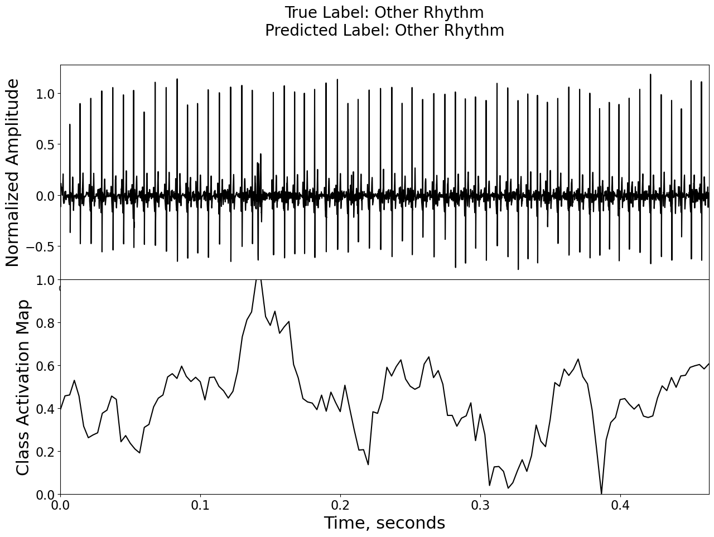
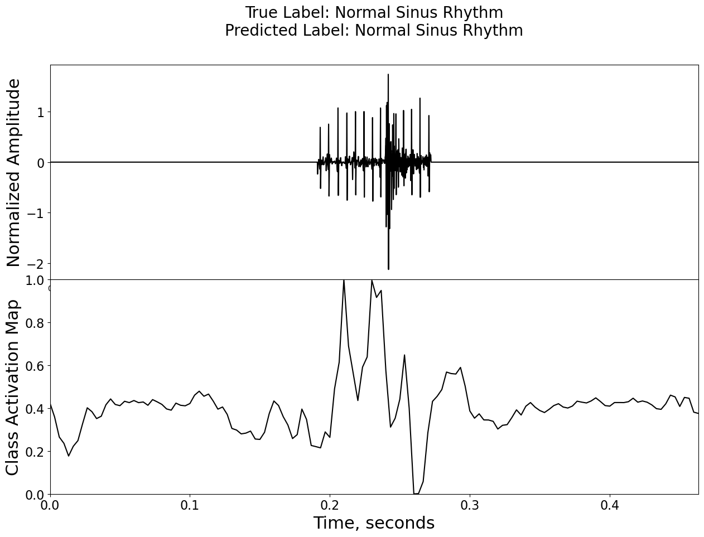

# Deep ECG Pytorch

Hi, here I decided to remaster deepecg network of Goodfellow et al. [https://github.com/Seb-Good/deepecg.git] on clear PyTorch. This CNNv7 architecture has two underestimated features for automated ECG treating.

First of all it has attention mapping with length close to initial time series. It allow us to investigate network decision making. This is vitally to show how it works with intuitive way. You will convince almost nobody in medical business to use your software with just classification of diseases.

The second feature names "dilation_rate" varied in range from 2 to 256 for different layers. It has potential to fit the periodical nature of ECG signal without manual Fourie, Wavelet or other expert level preprocessing. 

The original architecture was made of tensorflow which honestly hard to experiment with. In particular it tight to look inside network and realize how decisions made. Author made PyTorch version for Physionet challenge2020. But it is to optimized for challenge task. The most important parts were buried under a lot of classes simplifying experimentation with folds and others stuff. So I'v made this base level repository with minimal preprocessing and "sugar"  training stuff. Interpretation results compared to original paper. I hope somebody can use it to start his own experiments.
To quick start i made Kaggle notebook [https://www.kaggle.com/code/lavrikovav/deepecgpytorchpublic].

In the original study, "*a deep convolutional neural network was trained to classify single lead ECG waveforms as either 
Normal Sinus Rhythm, Atrial Fibrillation, or Other Rhythm. The study was run in two phases, the first to generate a 
classifier that performed at a level comparable to the top submission of the 
[2017 Physionet Challenge](https://www.physionet.org/challenge/2017/), and the second to extract class activation 
mappings to help better understand which areas of the waveform the model was focusing on when making a classification*"

Attention map examples from my experiments

fig.1 Other rhythm correctly predicted

fig.2 Normal sinus rhythm correctly predicted

It is quite clear example of activation map. You can clearly see at fig.2 that a mess area of the ECG has lower importance then others. Fig 1. also represents visually remarkable maximum area correlated with an ECG beats interruption.
Not everything areas so easy to explane.
